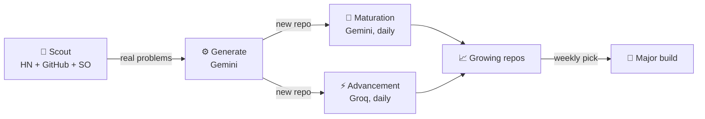

### 🤖 AutoScout — a system that builds while I sleep

Every day, three independent processes run without me touching them:

1. **Scout** — pulls real pain points from Hacker News, GitHub, and Stack Overflow, filtered to agentic AI (agent orchestration, memory, evals, guardrails, MCP, multi-agent coordination).
2. **Generate** — builds a new prototype repo targeting the highest-signal problem, in whatever language/format actually fits it.
3. **Advance** — two independent engines each pick one existing repo per day and push it one genuine step further, backed by live research:
   - a Gemini-powered loop in [AutoScout-Lab](https://github.com/sathiya-22/AutoScout-Lab)
   - a Groq-powered loop in [AutoScout-Engine](https://github.com/sathiya-22/AutoScout-Engine)

**📊 Live stats** (auto-updated daily, last refreshed 2026-07-17):

| | |
|---|---|
| Running since | 2026-07-07 (11 days) |
| Repos generated | 15 |
| Gemini maturation passes | 4 |
| Groq advancement passes | 4 |

🔗 [AutoScout-Lab](https://github.com/sathiya-22/AutoScout-Lab) (orchestrator + scout + generator) · [AutoScout-Engine](https://github.com/sathiya-22/AutoScout-Engine) (deep research-backed advancement)

 

 

<picture>
  <source media="(prefers-color-scheme: dark)" srcset="https://raw.githubusercontent.com/sathiya-22/sathiya-22/output/github-contribution-grid-snake-dark.svg" />
  <source media="(prefers-color-scheme: light)" srcset="https://raw.githubusercontent.com/sathiya-22/sathiya-22/output/github-contribution-grid-snake.svg" />
  
</picture>

 

**🛠️ AutoScout's stack**

| | |
|---|---|
| **Language** |  |
| **Models** |   |
| **Validation** |  |
| **Automation** |   |

**🔄 How it fits together**

